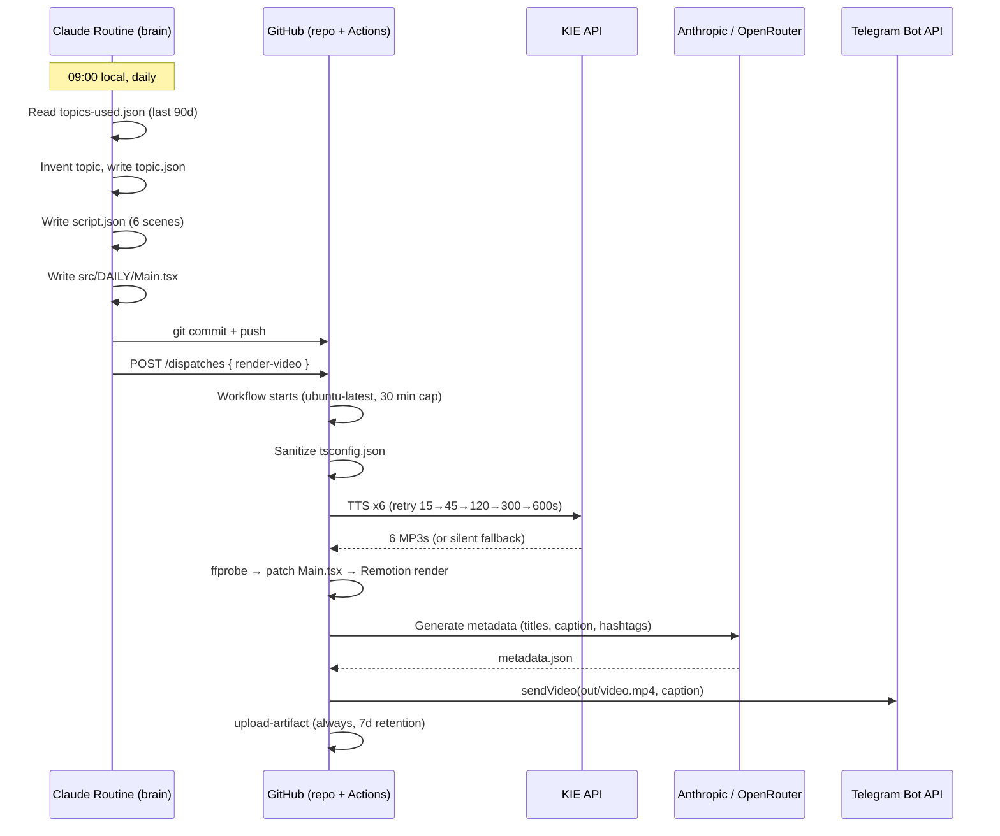

# Architecture

How the daily-short-video pipeline is wired, and why it's wired this way.

This document covers the system as it actually runs in production, not as a
greenfield design exercise. If something below reads "well that's an obvious
design," it's because the obvious design wins for a process that runs once a
day and tolerates ~17 minutes of latency.

---

## Overview

Two systems share one repo:



The Routine touches three repo files; CI takes it from there.

---

## Subsystems

### 1. Routine (content)

Lives in `ROUTINE.md`. Not code in this repo — read by a Claude Routine
session each morning. Picks a topic, writes a script, hand-writes
`src/DAILY/Main.tsx` as a `Series` of 6 scenes, commits to `main`.

Contract:
- Output: valid `topic.json`, `script.json`, `src/DAILY/Main.tsx`.
- Side effect: appends to `topics-used.json`.
- Hard rule (also in `ROUTINE.md`): never touches `tsconfig.json`.

### 2. Workflow (orchestration)

`.github/workflows/daily-short.yml`. One job, 9 steps, 30-minute timeout:

1. Checkout
2. Setup Node 20 (npm cache)
3. Setup Python 3.11
4. Install ffmpeg
5. `npm ci`
6. Verify inputs (`topic.json`, `script.json`, `src/DAILY/Main.tsx` present)
7. Sanitize `tsconfig.json` (strip bad `ignoreDeprecations`)
8. Run pipeline scripts in order
9. Always-on artifact upload (7-day retention)

Triggers: manual dispatch, `repository_dispatch: render-video`, or push on
content paths.

### 3. Pipeline (rendering)

Four Python scripts in `pipeline/`. Stdlib-only — no `pip install` step is
required in CI.

| Script | Role |
|---|---|
| `generate_audio.py` | KIE TTS per scene, retry-with-backoff, silent fallback |
| `render_video.py` | Measure with `ffprobe`, patch `Main.tsx`, `remotion render` |
| `generate_metadata.py` | Claude → titles + caption + hashtags |
| `send_telegram.py` | Multipart MP4 upload to a chat |

Communication between them is purely files in the working directory:
`public/audio/scene{1..6}.mp3` → `out/video.mp4` → `metadata.json`.

### 4. Composition (Remotion)

`src/Root.tsx` declares a single `<Composition id="DAILY-Short" />` at
1080×1920, 30 fps, 1800 frames (60 seconds), wired to `src/DAILY/Main.tsx`.

`Main.tsx` is a `<Series>` of 6 `<Scene{N}>` components. Each scene declares
its own animation; `render_video.py` injects the `SCENE_DURATIONS` array and
`<Audio src={staticFile(...)} />` per scene before rendering.

---

## Workflow walkthrough

Annotated breakdown of `.github/workflows/daily-short.yml`:

```yaml
on:
  workflow_dispatch:                       # Manual button for testing
  repository_dispatch: [render-video]      # Triggered by the Routine API call
  push: paths: [src/DAILY/Main.tsx, ...]   # Edit a JSON, ship a video
```

```yaml
timeout-minutes: 30
```

> Cap: KIE retries can stretch to ~17 min in the worst case (5 backoffs across
> 6 scenes is parallelizable, but `generate_audio.py` runs serially today).
> 30 min leaves headroom for the render + delivery steps.

```yaml
- Verify pipeline inputs exist
```

> Fails fast if the Routine pushed a partial commit. Better to see "topic.json
> missing" in the first 30 seconds than to discover it 25 minutes later when
> the render fails on an empty `script.json`.

```yaml
- Sanitize tsconfig.json
```

> Defensive: previous Routine sessions have added `"ignoreDeprecations":
> "..invalid.."` chasing a TS warning. The regex strips that key unconditionally
> before render. Documented in `ROUTINE.md` as a hard "do not touch."

```yaml
- name: Generate TTS audio
- name: Render video
- name: Generate metadata
- name: Deliver to Telegram
- name: Upload artifacts (if: always())
```

> Each pipeline step runs as its own workflow step so failures land on the
> right step name in the GitHub UI. The `always()` upload is the
> diagnostic safety net — a failed render still leaves you the half-baked MP4
> and the inputs that produced it.

---

## State & idempotency

State lives in four files at the repo root:

| File | Owned by | Lifecycle |
|---|---|---|
| `topic.json` | Routine | Overwritten daily |
| `script.json` | Routine | Overwritten daily |
| `topics-used.json` | Routine | Append-only (grows ~1 line/day) |
| `src/DAILY/Main.tsx` | Routine, patched in-flight by CI | Overwritten daily |

There is no external database. The repo is the database. Re-running the
workflow on the same commit produces a fresh render against the same inputs
— useful if Telegram delivery failed and you want to retry without picking
a new topic.

**Idempotency of the retry path.** Running the workflow twice on the same
content posts two videos. There's no "have I already posted today?" check
because Telegram has no native dedup primitive, and a delivered video is hard
to un-deliver. Operational guidance: prefer manual `gh workflow run` over
re-dispatch when investigating failures.

---

## Cost & resource accounting

Per-day cost is dominated by KIE TTS and Claude metadata generation, both of
which run once per day:

| Resource | Per day | Notes |
|---|---|---|
| GitHub Actions minutes | ~6–8 min | npm install + render dominate |
| KIE TTS characters | ~700 chars × 6 scenes | One MP3 per scene |
| Anthropic tokens | ~2k input + ~500 output | Single Claude call for metadata |
| Telegram | 1 video, 1 caption msg | Free |
| Storage | ~5 MB MP4, 7 days | GitHub Actions artifacts |

At a daily cadence this is comfortably below most free-tier ceilings.

---

## Failure modes

| Failure | Behavior |
|---|---|
| KIE 5xx, single scene | Retry up to 5x with backoff. After exhaustion: silent MP3 fallback + Telegram alert + `tts_failure.txt` marker. Render still completes. |
| KIE 5xx, all scenes | Same fallback per scene. Result: 60s silent video posted with alert. Recoverable: re-dispatch after KIE recovers. |
| Anthropic 5xx | Falls through to OpenRouter automatically. |
| Anthropic + OpenRouter both 5xx | `generate_metadata.py` exits non-zero. Render still exists; manual recovery: edit `metadata.json` and re-run only `send_telegram.py` locally with the artifact. |
| `topic.json` missing | Workflow exits at the verify step with a clear error. |
| Remotion render crash | Workflow exits non-zero. Inputs + (partial) artifacts uploaded for diagnosis. No auto-retry. |
| Telegram down | `send_telegram.py` errors. Re-dispatch when Telegram recovers — render is already in the artifact bundle. |

The design principle: **never let a transient third-party outage kill the day's
video.** Permanent failures degrade gracefully; logs and alerts surface them
without aborting.

---

## Security

- All secrets live in GitHub Actions encrypted secrets — never written to
  files or logged. `pipeline/*.py` read them from environment variables only.
- KIE / Anthropic / Telegram bot keys have no read access to anything beyond
  their own scopes (TTS quota, message API, single chat).
- The Telegram bot can only post to allowlisted chats (`TELEGRAM_CHAT_ID`).
- Repository dispatch from the Routine uses a PAT with `repo` scope only.
- No user-supplied input flows into the pipeline — the only inputs are
  Routine-authored JSON files committed to the repo, which are reviewed in the
  commit log.

---

## Future work

Concrete suggestions, ordered by ROI:

1. **JSON schema + render dry-run before Routine commits.**
   `script.json` is hand-authored by the Routine; today, a malformed scene
   slips through to CI before it fails. A `pipeline/validate_inputs.py` that
   the Routine runs locally before pushing would shift the failure left by
   ~10 minutes per bad-day.

2. **Parallelize TTS generation.** `generate_audio.py` currently iterates
   scenes serially. With 6 scenes and 15-second-best-case backoffs, this is
   a 5–6× speedup in the happy path. Use Python's `concurrent.futures`.

3. **Auto-retry Remotion render once.** A single retry on render crash costs
   ~3 min of runner time and would catch transient Chrome/Puppeteer flakes.

4. **LLM-judge eval on topics.** Before `render_video.py` runs, a quick
   Claude pass that scores the topic on click-through likelihood + factual
   plausibility would filter the ~5% of days where the Routine picks
   something flat. Plug into `evals/promptfoo.yaml`.

5. **Add TikTok + YouTube Shorts uploaders.** The metadata step already
   generates platform-specific titles and hashtags in anticipation; the
   pipeline just needs `pipeline/send_tiktok.py` and `pipeline/send_youtube.py`
   variants of the Telegram delivery step.

6. **Strip the in-flight `Main.tsx` patch.** The CI rewriting a source file
   before render is the most surprising part of the pipeline. A cleaner
   design: have the Routine emit `durations.json`, and have `Main.tsx`
   read it via `staticFile`. No file mutation in CI. Lower magic, easier
   for a new engineer to read.
